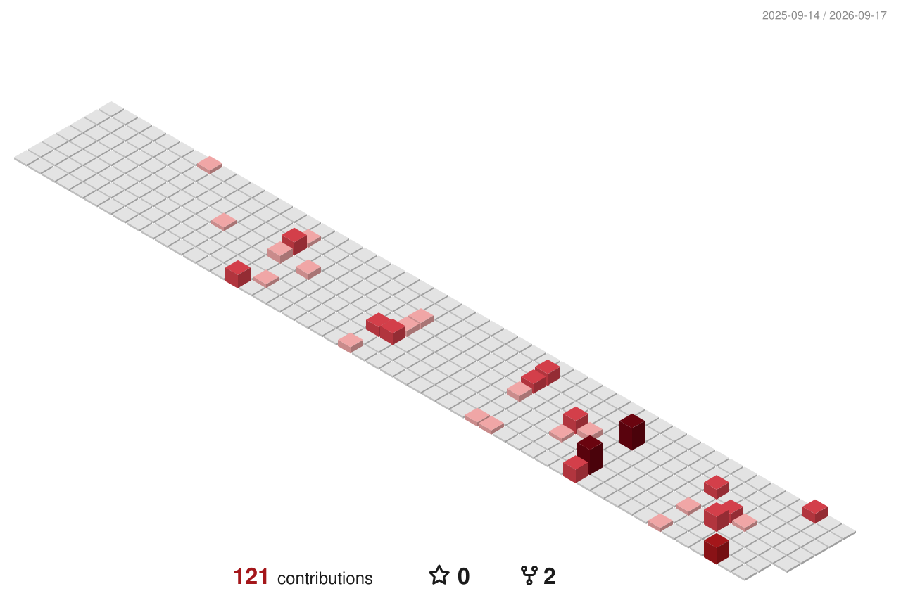

<div align="center">
  
</div>

<div align="center">


<br/>

<a href="https://linkedin.com/in/anubhav-bayard"></a>
<a href="https://x.com/Achieve77531039"></a>
<a href="https://instagram.com/anubhavbayard"></a>
<a href="https://portfolio-plum-nine-t83py48y94.vercel.app/"></a>
<a href="mailto:anubhavbayard.100@gmail.com"></a>

<br/>


</div>

<div align="center">
<samp>ᚦ&nbsp;&nbsp;═══════════════════════════════════════════════&nbsp;&nbsp;ᚦ</samp>
</div>

<h3 align="center">ᛃ &nbsp; THE JARL &nbsp; ᛃ</h3>

<div align="center">
<samp>&nbsp;&nbsp;&nbsp;&nbsp;&nbsp;&nbsp;&nbsp;&nbsp;.-&quot;&quot;-.&nbsp;&nbsp;&nbsp;&nbsp;&nbsp;&nbsp;&nbsp;&nbsp;NAME&nbsp;&nbsp;...&nbsp;&nbsp;Anubhav&nbsp;Bayard&nbsp;&nbsp;&nbsp;&nbsp;&nbsp;&nbsp;&nbsp;&nbsp;&nbsp;&nbsp;&nbsp;&nbsp;&nbsp;&nbsp;&nbsp;&nbsp;&nbsp;&nbsp;&nbsp;&nbsp;&nbsp;&nbsp;&nbsp;&nbsp;&nbsp;&nbsp;&nbsp;&nbsp;&nbsp;&nbsp;<br/>
&nbsp;&nbsp;&nbsp;&nbsp;&nbsp;&nbsp;&nbsp;/&nbsp;.--.&nbsp;\&nbsp;&nbsp;&nbsp;&nbsp;&nbsp;&nbsp;&nbsp;TITLE&nbsp;...&nbsp;&nbsp;Software&nbsp;Developer&nbsp;·&nbsp;Open&nbsp;Source&nbsp;Raider&nbsp;&nbsp;&nbsp;&nbsp;&nbsp;<br/>
&nbsp;&nbsp;&nbsp;&nbsp;&nbsp;&nbsp;/&nbsp;/&nbsp;&nbsp;&nbsp;&nbsp;\&nbsp;\&nbsp;&nbsp;&nbsp;&nbsp;&nbsp;&nbsp;HALL&nbsp;&nbsp;...&nbsp;&nbsp;The&nbsp;Terminal&nbsp;&nbsp;&nbsp;&nbsp;&nbsp;&nbsp;&nbsp;&nbsp;&nbsp;&nbsp;&nbsp;&nbsp;&nbsp;&nbsp;&nbsp;&nbsp;&nbsp;&nbsp;&nbsp;&nbsp;&nbsp;&nbsp;&nbsp;&nbsp;&nbsp;&nbsp;&nbsp;&nbsp;&nbsp;&nbsp;&nbsp;&nbsp;<br/>
&nbsp;&nbsp;&nbsp;&nbsp;&nbsp;&nbsp;|&nbsp;|&nbsp;&nbsp;&nbsp;&nbsp;|&nbsp;|&nbsp;&nbsp;&nbsp;&nbsp;&nbsp;&nbsp;OATH&nbsp;&nbsp;...&nbsp;&nbsp;Do&nbsp;the&nbsp;work.&nbsp;Do&nbsp;it&nbsp;well.&nbsp;Never&nbsp;stop&nbsp;growing.<br/>
&nbsp;&nbsp;&nbsp;&nbsp;&nbsp;&nbsp;|&nbsp;|.-&quot;&quot;-.|&nbsp;&nbsp;&nbsp;&nbsp;&nbsp;&nbsp;RUNE&nbsp;&nbsp;...&nbsp;&nbsp;ᚨ&nbsp;&nbsp;ansuz&nbsp;—&nbsp;the&nbsp;word,&nbsp;the&nbsp;craft,&nbsp;the&nbsp;signal&nbsp;&nbsp;<br/>
&nbsp;&nbsp;&nbsp;&nbsp;&nbsp;///`.::::.`\&nbsp;&nbsp;&nbsp;&nbsp;&nbsp;FACT&nbsp;&nbsp;...&nbsp;&nbsp;An&nbsp;outstanding&nbsp;introvert&nbsp;&nbsp;&nbsp;&nbsp;&nbsp;&nbsp;&nbsp;&nbsp;&nbsp;&nbsp;&nbsp;&nbsp;&nbsp;&nbsp;&nbsp;&nbsp;&nbsp;&nbsp;&nbsp;&nbsp;<br/>
&nbsp;&nbsp;&nbsp;&nbsp;|||&nbsp;::/&nbsp;&nbsp;\::&nbsp;;&nbsp;&nbsp;&nbsp;&nbsp;&nbsp;&nbsp;&nbsp;&nbsp;&nbsp;&nbsp;&nbsp;&nbsp;&nbsp;&nbsp;&nbsp;&nbsp;&nbsp;&nbsp;&nbsp;&nbsp;&nbsp;&nbsp;&nbsp;&nbsp;&nbsp;&nbsp;&nbsp;&nbsp;&nbsp;&nbsp;&nbsp;&nbsp;&nbsp;&nbsp;&nbsp;&nbsp;&nbsp;&nbsp;&nbsp;&nbsp;&nbsp;&nbsp;&nbsp;&nbsp;&nbsp;&nbsp;&nbsp;&nbsp;&nbsp;&nbsp;&nbsp;&nbsp;&nbsp;&nbsp;&nbsp;&nbsp;&nbsp;&nbsp;&nbsp;<br/>
&nbsp;&nbsp;&nbsp;&nbsp;||;&nbsp;::\__/::&nbsp;;&nbsp;&nbsp;&nbsp;&nbsp;Studying&nbsp;system&nbsp;design&nbsp;fundamentals,&nbsp;so&nbsp;every&nbsp;&nbsp;&nbsp;&nbsp;&nbsp;&nbsp;&nbsp;&nbsp;&nbsp;&nbsp;<br/>
&nbsp;&nbsp;&nbsp;&nbsp;&nbsp;\\\&nbsp;&#x27;::::&#x27;&nbsp;/&nbsp;&nbsp;&nbsp;&nbsp;&nbsp;trade-off&nbsp;at&nbsp;scale&nbsp;is&nbsp;a&nbsp;choice,&nbsp;never&nbsp;an&nbsp;accident.&nbsp;&nbsp;&nbsp;&nbsp;&nbsp;<br/>
&nbsp;&nbsp;&nbsp;&nbsp;&nbsp;&nbsp;`=&#x27;:-..-&#x27;`&nbsp;&nbsp;&nbsp;&nbsp;&nbsp;&nbsp;&nbsp;&nbsp;&nbsp;&nbsp;&nbsp;&nbsp;&nbsp;&nbsp;&nbsp;&nbsp;&nbsp;&nbsp;&nbsp;&nbsp;&nbsp;&nbsp;&nbsp;&nbsp;&nbsp;&nbsp;&nbsp;&nbsp;&nbsp;&nbsp;&nbsp;&nbsp;&nbsp;&nbsp;&nbsp;&nbsp;&nbsp;&nbsp;&nbsp;&nbsp;&nbsp;&nbsp;&nbsp;&nbsp;&nbsp;&nbsp;&nbsp;&nbsp;&nbsp;&nbsp;&nbsp;&nbsp;&nbsp;&nbsp;&nbsp;&nbsp;&nbsp;&nbsp;&nbsp;&nbsp;&nbsp;</samp>
</div>

<div align="center">
<samp>ᚱ&nbsp;&nbsp;&nbsp;SAILING&nbsp;TOWARD&nbsp;&nbsp;...&nbsp;&nbsp;scalable&nbsp;web&nbsp;systems,&nbsp;clean&nbsp;architecture&nbsp;&nbsp;&nbsp;<br/>
ᚲ&nbsp;&nbsp;&nbsp;FORGING&nbsp;&nbsp;&nbsp;&nbsp;&nbsp;&nbsp;&nbsp;&nbsp;&nbsp;...&nbsp;&nbsp;Web&nbsp;Development,&nbsp;backend&nbsp;craft,&nbsp;honest&nbsp;APIs<br/>
ᛗ&nbsp;&nbsp;&nbsp;SEEKING&nbsp;CREW&nbsp;&nbsp;&nbsp;&nbsp;...&nbsp;&nbsp;open&nbsp;source,&nbsp;ambitious&nbsp;web&nbsp;builds&nbsp;&nbsp;&nbsp;&nbsp;&nbsp;&nbsp;&nbsp;&nbsp;&nbsp;&nbsp;<br/>
ᛊ&nbsp;&nbsp;&nbsp;ASK&nbsp;ME&nbsp;OF&nbsp;&nbsp;&nbsp;&nbsp;&nbsp;&nbsp;&nbsp;...&nbsp;&nbsp;my&nbsp;life&nbsp;:)&nbsp;&nbsp;&nbsp;&nbsp;&nbsp;&nbsp;&nbsp;&nbsp;&nbsp;&nbsp;&nbsp;&nbsp;&nbsp;&nbsp;&nbsp;&nbsp;&nbsp;&nbsp;&nbsp;&nbsp;&nbsp;&nbsp;&nbsp;&nbsp;&nbsp;&nbsp;&nbsp;&nbsp;&nbsp;&nbsp;&nbsp;&nbsp;&nbsp;<br/>
ᚹ&nbsp;&nbsp;&nbsp;SEND&nbsp;WORD&nbsp;&nbsp;&nbsp;&nbsp;&nbsp;&nbsp;&nbsp;...&nbsp;&nbsp;anubhavbayard.100@gmail.com&nbsp;&nbsp;&nbsp;&nbsp;&nbsp;&nbsp;&nbsp;&nbsp;&nbsp;&nbsp;&nbsp;&nbsp;&nbsp;&nbsp;&nbsp;&nbsp;</samp>
</div>

<div align="center">
<samp>ᚦ&nbsp;&nbsp;═══════════════════════════════════════════════&nbsp;&nbsp;ᚦ</samp>
</div>

<h3 align="center">ᛏ &nbsp; THE ARMOURY &nbsp; ᛏ</h3>

<div align="center">
<samp>&nbsp;&nbsp;&nbsp;\\&nbsp;&nbsp;&nbsp;&nbsp;&nbsp;&nbsp;&nbsp;&nbsp;&nbsp;&nbsp;&nbsp;&nbsp;&nbsp;&nbsp;&nbsp;&nbsp;&nbsp;&nbsp;&nbsp;&nbsp;&nbsp;&nbsp;&nbsp;&nbsp;&nbsp;&nbsp;&nbsp;&nbsp;&nbsp;&nbsp;&nbsp;&nbsp;&nbsp;&nbsp;&nbsp;&nbsp;&nbsp;&nbsp;&nbsp;&nbsp;&nbsp;&nbsp;//&nbsp;&nbsp;&nbsp;<br/>
&nbsp;&nbsp;&nbsp;&nbsp;\\________________&nbsp;&nbsp;_________________________//&nbsp;<br/>
&nbsp;&nbsp;&nbsp;&nbsp;&nbsp;[___MJOLNIR______][____SEAX_________________&gt;&nbsp;&nbsp;<br/>
&nbsp;&nbsp;&nbsp;&nbsp;//&nbsp;&nbsp;&nbsp;&nbsp;&nbsp;&nbsp;&nbsp;&nbsp;&nbsp;&nbsp;&nbsp;&nbsp;&nbsp;&nbsp;&nbsp;&nbsp;&nbsp;&nbsp;&nbsp;&nbsp;&nbsp;&nbsp;&nbsp;&nbsp;&nbsp;&nbsp;&nbsp;&nbsp;&nbsp;&nbsp;&nbsp;&nbsp;&nbsp;&nbsp;&nbsp;&nbsp;&nbsp;&nbsp;&nbsp;&nbsp;&nbsp;&nbsp;\\&nbsp;&nbsp;<br/>
&nbsp;&nbsp;&nbsp;//&nbsp;&nbsp;&nbsp;&nbsp;&nbsp;weapons&nbsp;carried&nbsp;into&nbsp;every&nbsp;raid&nbsp;&nbsp;&nbsp;&nbsp;&nbsp;&nbsp;&nbsp;&nbsp;&nbsp;\\</samp>
</div>

<div align="center">

<b>BLADES &nbsp;·&nbsp; languages</b>


<b>LONGSHIPS &nbsp;·&nbsp; frameworks &amp; runtime</b>


<b>FORGE &nbsp;·&nbsp; tools &amp; halls</b>


</div>

<div align="center">
<samp>ᚦ&nbsp;&nbsp;═══════════════════════════════════════════════&nbsp;&nbsp;ᚦ</samp>
</div>

<h3 align="center">ᚱ &nbsp; THE RAID LOG &nbsp; ᚱ</h3>

<div align="center">
<samp>every&nbsp;raid&nbsp;a&nbsp;rune&nbsp;carved&nbsp;in&nbsp;stone&nbsp;—&nbsp;one&nbsp;year&nbsp;of&nbsp;plunder,&nbsp;in&nbsp;three&nbsp;dimensions</samp>
</div>

<div align="center">



<sub>carved anew each dawn by GitHub Actions · <a href="https://github.com/yoshi389111/github-profile-3d-contrib">github-profile-3d-contrib</a></sub>

</div>

<div align="center">
<samp>ᚦ&nbsp;&nbsp;═══════════════════════════════════════════════&nbsp;&nbsp;ᚦ</samp>
</div>

<h3 align="center">ᛃ &nbsp; JÖRMUNGANDR &nbsp; ᛃ</h3>

<div align="center">
<samp>the&nbsp;world&nbsp;serpent&nbsp;wakes,&nbsp;and&nbsp;devours&nbsp;the&nbsp;runes&nbsp;of&nbsp;the&nbsp;year</samp>
</div>

<div align="center">
<samp>&nbsp;&nbsp;&nbsp;&nbsp;&nbsp;&nbsp;&nbsp;&nbsp;&nbsp;&nbsp;&nbsp;&nbsp;&nbsp;&nbsp;&nbsp;&nbsp;&nbsp;&nbsp;&nbsp;&nbsp;&nbsp;&nbsp;&nbsp;___&nbsp;&nbsp;&nbsp;&nbsp;&nbsp;&nbsp;&nbsp;&nbsp;&nbsp;&nbsp;&nbsp;&nbsp;&nbsp;&nbsp;&nbsp;&nbsp;&nbsp;&nbsp;&nbsp;&nbsp;&nbsp;&nbsp;&nbsp;&nbsp;&nbsp;&nbsp;&nbsp;&nbsp;&nbsp;&nbsp;&nbsp;<br/>
&nbsp;&nbsp;&nbsp;&nbsp;&nbsp;&nbsp;&nbsp;&nbsp;&nbsp;&nbsp;&nbsp;&nbsp;&nbsp;&nbsp;&nbsp;&nbsp;&nbsp;&nbsp;&nbsp;&nbsp;.-&#x27;&nbsp;&nbsp;&nbsp;`&#x27;.&nbsp;&nbsp;&nbsp;&nbsp;&nbsp;&nbsp;&nbsp;&nbsp;&nbsp;&nbsp;&nbsp;&nbsp;&nbsp;&nbsp;&nbsp;&nbsp;&nbsp;&nbsp;&nbsp;&nbsp;&nbsp;&nbsp;&nbsp;&nbsp;&nbsp;&nbsp;&nbsp;&nbsp;<br/>
&nbsp;&nbsp;&nbsp;&nbsp;&nbsp;&nbsp;&nbsp;&nbsp;&nbsp;&nbsp;&nbsp;&nbsp;&nbsp;&nbsp;&nbsp;&nbsp;&nbsp;&nbsp;&nbsp;/&nbsp;&nbsp;&nbsp;&nbsp;&nbsp;&nbsp;&nbsp;&nbsp;&nbsp;\&nbsp;&nbsp;&nbsp;&nbsp;&nbsp;&nbsp;&nbsp;&nbsp;&nbsp;&nbsp;&nbsp;&nbsp;&nbsp;&nbsp;&nbsp;&nbsp;&nbsp;&nbsp;&nbsp;&nbsp;&nbsp;&nbsp;&nbsp;&nbsp;&nbsp;&nbsp;&nbsp;<br/>
&nbsp;&nbsp;&nbsp;&nbsp;&nbsp;&nbsp;&nbsp;&nbsp;&nbsp;&nbsp;&nbsp;&nbsp;&nbsp;&nbsp;&nbsp;&nbsp;&nbsp;&nbsp;&nbsp;|&nbsp;&nbsp;&nbsp;&nbsp;&nbsp;&nbsp;&nbsp;&nbsp;&nbsp;;&nbsp;&nbsp;&nbsp;&nbsp;&nbsp;&nbsp;&nbsp;&nbsp;&nbsp;&nbsp;&nbsp;&nbsp;&nbsp;&nbsp;&nbsp;&nbsp;&nbsp;&nbsp;&nbsp;&nbsp;&nbsp;&nbsp;&nbsp;&nbsp;&nbsp;&nbsp;&nbsp;<br/>
&nbsp;&nbsp;&nbsp;&nbsp;&nbsp;&nbsp;&nbsp;&nbsp;&nbsp;&nbsp;&nbsp;&nbsp;&nbsp;&nbsp;&nbsp;&nbsp;&nbsp;&nbsp;&nbsp;|&nbsp;&nbsp;&nbsp;&nbsp;&nbsp;&nbsp;&nbsp;&nbsp;&nbsp;|&nbsp;&nbsp;&nbsp;&nbsp;&nbsp;&nbsp;&nbsp;&nbsp;&nbsp;&nbsp;&nbsp;___.--,&nbsp;&nbsp;&nbsp;&nbsp;&nbsp;&nbsp;&nbsp;&nbsp;&nbsp;<br/>
&nbsp;&nbsp;&nbsp;&nbsp;&nbsp;&nbsp;&nbsp;&nbsp;&nbsp;&nbsp;_.._&nbsp;&nbsp;&nbsp;&nbsp;&nbsp;|0)&nbsp;~&nbsp;(0)&nbsp;|&nbsp;&nbsp;&nbsp;&nbsp;_.---&#x27;`__.-(&nbsp;(_.&nbsp;&nbsp;&nbsp;&nbsp;&nbsp;&nbsp;&nbsp;<br/>
&nbsp;&nbsp;&nbsp;__.--&#x27;`_..&nbsp;&#x27;.__.\&nbsp;&nbsp;&nbsp;&nbsp;&#x27;--.&nbsp;\_.-&#x27;&nbsp;,.--&#x27;`&nbsp;&nbsp;&nbsp;&nbsp;&nbsp;`&quot;&quot;`&nbsp;&nbsp;&nbsp;&nbsp;&nbsp;&nbsp;&nbsp;<br/>
&nbsp;&nbsp;(&nbsp;,.--&#x27;`&nbsp;&nbsp;&nbsp;&#x27;,__&nbsp;/./;&nbsp;&nbsp;&nbsp;;,&nbsp;&#x27;.__.&#x27;`&nbsp;&nbsp;&nbsp;&nbsp;__&nbsp;&nbsp;&nbsp;&nbsp;&nbsp;&nbsp;&nbsp;&nbsp;&nbsp;&nbsp;&nbsp;&nbsp;&nbsp;&nbsp;&nbsp;&nbsp;<br/>
&nbsp;&nbsp;_`)&nbsp;)&nbsp;&nbsp;.---.__.&#x27;&nbsp;/&nbsp;|&nbsp;&nbsp;&nbsp;|\&nbsp;&nbsp;&nbsp;\__..--&quot;&quot;&nbsp;&nbsp;&quot;&quot;&quot;--.,_&nbsp;&nbsp;&nbsp;&nbsp;&nbsp;&nbsp;&nbsp;&nbsp;<br/>
&nbsp;`---&#x27;&nbsp;.&#x27;.&#x27;&#x27;-._.-&#x27;`_./&nbsp;&nbsp;/\&nbsp;&#x27;.&nbsp;&nbsp;\&nbsp;_.--&#x27;&#x27;````&#x27;&#x27;&#x27;--._`-.__.&#x27;<br/>
&nbsp;&nbsp;&nbsp;&nbsp;&nbsp;&nbsp;&nbsp;|&nbsp;|&nbsp;&nbsp;.&#x27;&nbsp;_.-&#x27;&nbsp;|&nbsp;&nbsp;|&nbsp;&nbsp;\&nbsp;&nbsp;\&nbsp;&nbsp;&#x27;.&nbsp;&nbsp;&nbsp;&nbsp;&nbsp;&nbsp;&nbsp;&nbsp;&nbsp;&nbsp;&nbsp;&nbsp;&nbsp;&nbsp;&nbsp;`----`&nbsp;&nbsp;<br/>
&nbsp;&nbsp;&nbsp;&nbsp;&nbsp;&nbsp;&nbsp;&nbsp;\&nbsp;\/&nbsp;.&#x27;&nbsp;&nbsp;&nbsp;&nbsp;&nbsp;\&nbsp;&nbsp;\&nbsp;&nbsp;&nbsp;&#x27;.&nbsp;&#x27;-._)&nbsp;&nbsp;&nbsp;&nbsp;&nbsp;&nbsp;&nbsp;&nbsp;&nbsp;&nbsp;&nbsp;&nbsp;&nbsp;&nbsp;&nbsp;&nbsp;&nbsp;&nbsp;&nbsp;&nbsp;&nbsp;&nbsp;<br/>
&nbsp;&nbsp;&nbsp;&nbsp;&nbsp;&nbsp;&nbsp;&nbsp;&nbsp;\/&nbsp;/&nbsp;&nbsp;&nbsp;&nbsp;&nbsp;&nbsp;&nbsp;&nbsp;\&nbsp;&nbsp;\&nbsp;&nbsp;&nbsp;&nbsp;`=.__`&#x27;-.&nbsp;&nbsp;&nbsp;&nbsp;&nbsp;&nbsp;&nbsp;&nbsp;&nbsp;&nbsp;&nbsp;&nbsp;&nbsp;&nbsp;&nbsp;&nbsp;&nbsp;&nbsp;&nbsp;<br/>
&nbsp;&nbsp;&nbsp;&nbsp;&nbsp;&nbsp;&nbsp;&nbsp;&nbsp;/&nbsp;/\&nbsp;&nbsp;&nbsp;&nbsp;&nbsp;&nbsp;&nbsp;&nbsp;&nbsp;`)&nbsp;)&nbsp;&nbsp;&nbsp;&nbsp;/&nbsp;/&nbsp;`&quot;&quot;.`\&nbsp;&nbsp;&nbsp;&nbsp;&nbsp;&nbsp;&nbsp;&nbsp;&nbsp;&nbsp;&nbsp;&nbsp;&nbsp;&nbsp;&nbsp;&nbsp;&nbsp;<br/>
&nbsp;&nbsp;&nbsp;,&nbsp;_.-&#x27;.&#x27;\&nbsp;\&nbsp;&nbsp;&nbsp;&nbsp;&nbsp;&nbsp;&nbsp;&nbsp;/&nbsp;/&nbsp;&nbsp;&nbsp;&nbsp;(&nbsp;(&nbsp;&nbsp;&nbsp;&nbsp;&nbsp;/&nbsp;/&nbsp;&nbsp;&nbsp;&nbsp;&nbsp;&nbsp;&nbsp;&nbsp;&nbsp;&nbsp;&nbsp;&nbsp;&nbsp;&nbsp;&nbsp;&nbsp;&nbsp;<br/>
&nbsp;&nbsp;&nbsp;&nbsp;`--&#x27;`&nbsp;&nbsp;&nbsp;)&nbsp;)&nbsp;&nbsp;&nbsp;&nbsp;.-&#x27;.&#x27;&nbsp;&nbsp;&nbsp;&nbsp;&nbsp;&nbsp;&#x27;.&#x27;.&nbsp;&nbsp;|&nbsp;(&nbsp;&nbsp;&nbsp;&nbsp;&nbsp;&nbsp;&nbsp;&nbsp;&nbsp;&nbsp;&nbsp;&nbsp;&nbsp;&nbsp;&nbsp;&nbsp;&nbsp;&nbsp;<br/>
&nbsp;&nbsp;&nbsp;&nbsp;&nbsp;&nbsp;&nbsp;&nbsp;&nbsp;&nbsp;&nbsp;(/`&nbsp;&nbsp;&nbsp;&nbsp;(&nbsp;(`&nbsp;&nbsp;&nbsp;&nbsp;&nbsp;&nbsp;&nbsp;&nbsp;&nbsp;&nbsp;)&nbsp;)&nbsp;&nbsp;&#x27;-;&nbsp;&nbsp;&nbsp;&nbsp;&nbsp;&nbsp;&nbsp;&nbsp;&nbsp;&nbsp;&nbsp;&nbsp;&nbsp;&nbsp;&nbsp;&nbsp;&nbsp;<br/>
&nbsp;&nbsp;&nbsp;&nbsp;&nbsp;&nbsp;&nbsp;&nbsp;&nbsp;&nbsp;&nbsp;&nbsp;`&nbsp;&nbsp;&nbsp;&nbsp;&nbsp;&nbsp;&#x27;-;&nbsp;&nbsp;&nbsp;&nbsp;&nbsp;&nbsp;&nbsp;&nbsp;&nbsp;(-&#x27;&nbsp;&nbsp;&nbsp;&nbsp;&nbsp;&nbsp;&nbsp;&nbsp;&nbsp;&nbsp;&nbsp;&nbsp;&nbsp;&nbsp;&nbsp;&nbsp;&nbsp;&nbsp;&nbsp;&nbsp;&nbsp;&nbsp;&nbsp;</samp>
</div>

<div align="center">

<picture>
  <source media="(prefers-color-scheme: dark)" srcset="https://raw.githubusercontent.com/AnubhavBayard/AnubhavBayard/output/serpent-dark.svg" />
  <source media="(prefers-color-scheme: light)" srcset="https://raw.githubusercontent.com/AnubhavBayard/AnubhavBayard/output/serpent.svg" />
  
</picture>

</div>

<div align="center">
<samp>ᚦ&nbsp;&nbsp;═══════════════════════════════════════════════&nbsp;&nbsp;ᚦ</samp>
</div>

<h3 align="center">ᚺ &nbsp; HÁVAMÁL &nbsp; ᚺ</h3>

<div align="center">
<samp>&quot;Cattle&nbsp;die,&nbsp;kinsmen&nbsp;die,&nbsp;&nbsp;&nbsp;&nbsp;&nbsp;&nbsp;&nbsp;&nbsp;&nbsp;&nbsp;&nbsp;&nbsp;&nbsp;&nbsp;&nbsp;&nbsp;&nbsp;&nbsp;&nbsp;&nbsp;&nbsp;&nbsp;&nbsp;&nbsp;&nbsp;&nbsp;&nbsp;&nbsp;<br/>
&nbsp;and&nbsp;so&nbsp;must&nbsp;one&nbsp;die&nbsp;oneself.&nbsp;&nbsp;&nbsp;&nbsp;&nbsp;&nbsp;&nbsp;&nbsp;&nbsp;&nbsp;&nbsp;&nbsp;&nbsp;&nbsp;&nbsp;&nbsp;&nbsp;&nbsp;&nbsp;&nbsp;&nbsp;&nbsp;&nbsp;&nbsp;<br/>
&nbsp;But&nbsp;one&nbsp;thing&nbsp;I&nbsp;know&nbsp;that&nbsp;never&nbsp;dies:&nbsp;&nbsp;&nbsp;&nbsp;&nbsp;&nbsp;&nbsp;&nbsp;&nbsp;&nbsp;&nbsp;&nbsp;&nbsp;&nbsp;&nbsp;<br/>
&nbsp;the&nbsp;reputation&nbsp;of&nbsp;the&nbsp;one&nbsp;who&nbsp;has&nbsp;passed.&quot;&nbsp;&nbsp;&nbsp;&nbsp;&nbsp;&nbsp;&nbsp;&nbsp;&nbsp;&nbsp;<br/>
&nbsp;&nbsp;&nbsp;&nbsp;&nbsp;&nbsp;&nbsp;&nbsp;&nbsp;&nbsp;&nbsp;&nbsp;&nbsp;&nbsp;&nbsp;&nbsp;&nbsp;&nbsp;&nbsp;&nbsp;&nbsp;&nbsp;&nbsp;&nbsp;&nbsp;&nbsp;&nbsp;&nbsp;&nbsp;&nbsp;&nbsp;&nbsp;&nbsp;&nbsp;&nbsp;&nbsp;&nbsp;&nbsp;&nbsp;&nbsp;&nbsp;&nbsp;&nbsp;&nbsp;&nbsp;&nbsp;&nbsp;&nbsp;&nbsp;&nbsp;&nbsp;&nbsp;&nbsp;<br/>
&nbsp;&nbsp;&nbsp;&nbsp;&nbsp;&nbsp;&nbsp;&nbsp;&nbsp;&nbsp;&nbsp;&nbsp;&nbsp;&nbsp;&nbsp;&nbsp;&nbsp;&nbsp;&nbsp;&nbsp;&nbsp;&nbsp;&nbsp;&nbsp;&nbsp;&nbsp;&nbsp;&nbsp;&nbsp;&nbsp;—&nbsp;Hávamál,&nbsp;st.&nbsp;77&nbsp;&nbsp;&nbsp;&nbsp;&nbsp;&nbsp;<br/>
&nbsp;&nbsp;&nbsp;&nbsp;&nbsp;&nbsp;&nbsp;&nbsp;&nbsp;&nbsp;&nbsp;&nbsp;&nbsp;&nbsp;&nbsp;&nbsp;&nbsp;&nbsp;&nbsp;&nbsp;&nbsp;&nbsp;&nbsp;&nbsp;&nbsp;&nbsp;&nbsp;&nbsp;&nbsp;&nbsp;&nbsp;&nbsp;&nbsp;&nbsp;&nbsp;&nbsp;&nbsp;&nbsp;&nbsp;&nbsp;&nbsp;&nbsp;&nbsp;&nbsp;&nbsp;&nbsp;&nbsp;&nbsp;&nbsp;&nbsp;&nbsp;&nbsp;&nbsp;<br/>
ship&nbsp;code&nbsp;that&nbsp;outlives&nbsp;the&nbsp;branch&nbsp;it&nbsp;was&nbsp;written&nbsp;on.</samp>
</div>

<div align="center">
<samp>ᚦ&nbsp;&nbsp;═══════════════════════════════════════════════&nbsp;&nbsp;ᚦ</samp>
</div>

<div align="center">
  
</div>
