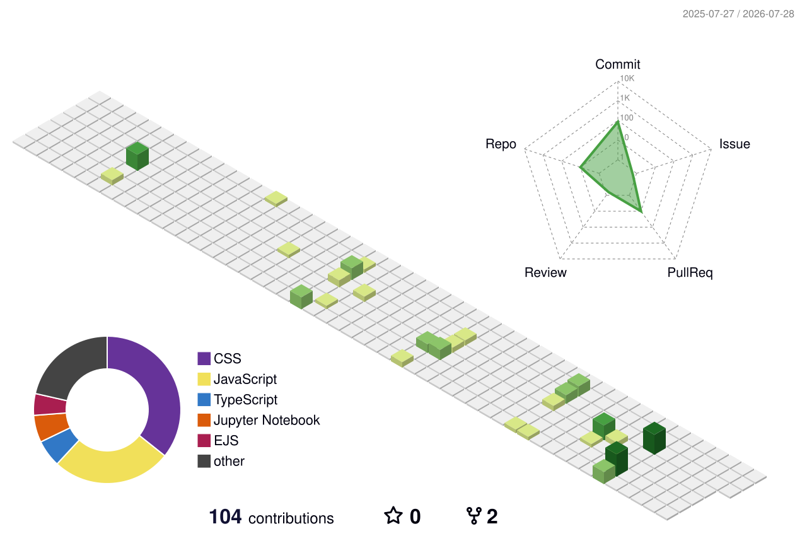
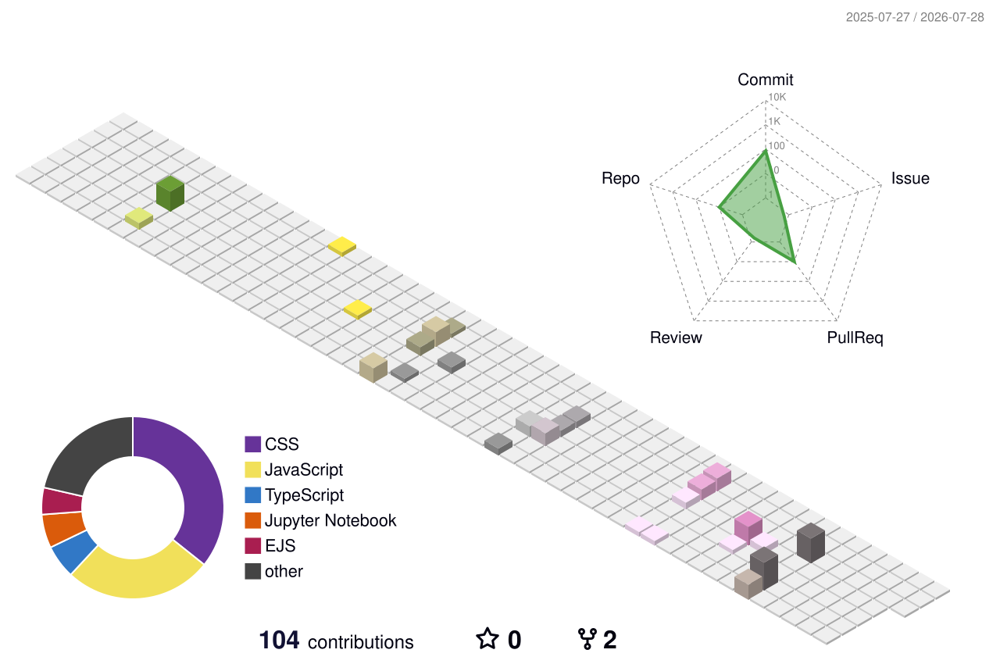
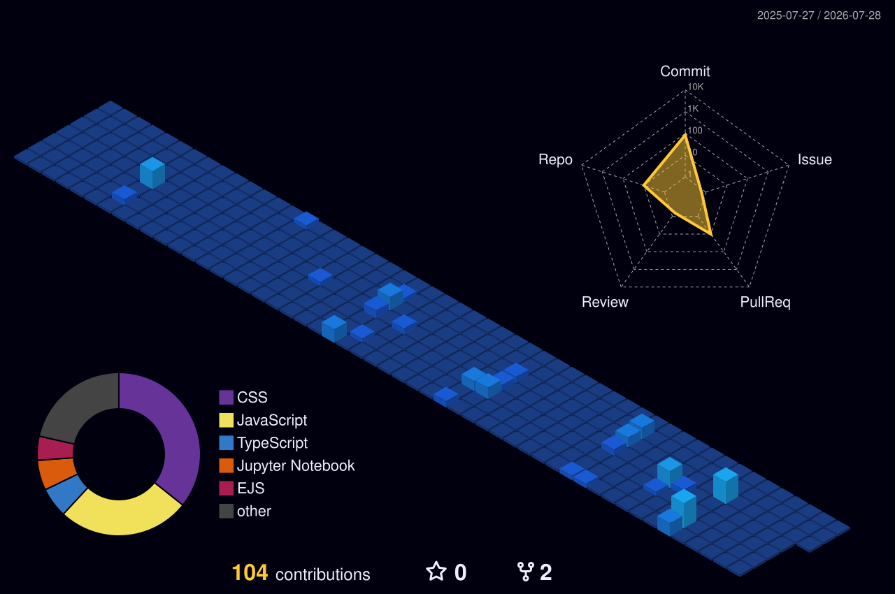
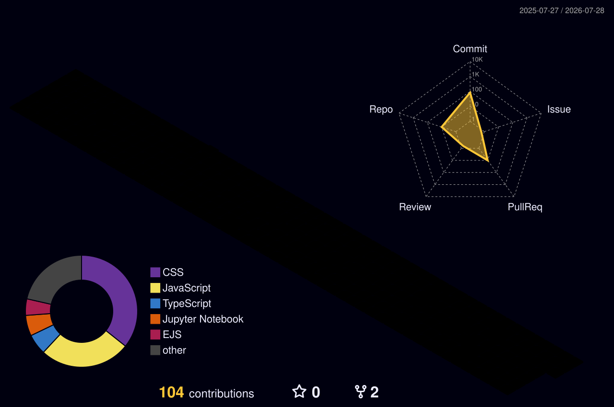
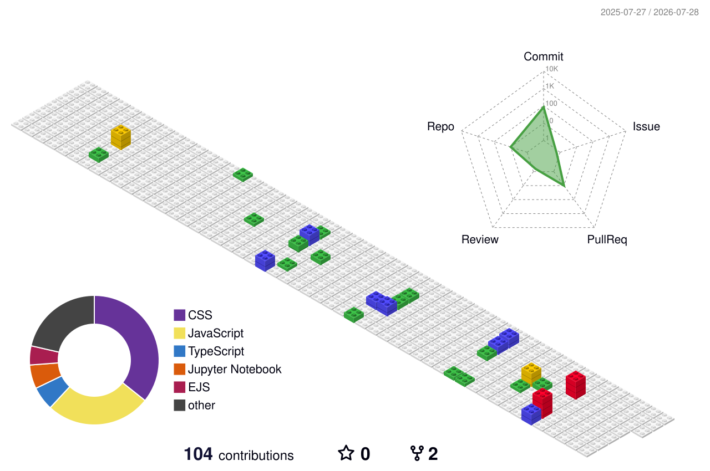

<div align="center">

<a href="https://portfolio-plum-nine-t83py48y94.vercel.app/">
  
</a>

<br/>


</div>

---

## 🧬 About Me

```yaml
name:        Anubhav Bayard
role:        Software Developer
learning:    Web Development + System Design fundamentals
collab_on:   Building scalable websites
ask_me:      My life :)
fun_fact:    I am an outstanding introvert :)
motto:       Do the work. Do it well. Never stop growing.
```

<table>
  <tr>
    <td>🔭 <b>Portfolio</b></td>
    <td><a href="https://portfolio-plum-nine-t83py48y94.vercel.app/">portfolio-plum-nine.vercel.app</a></td>
  </tr>
  <tr>
    <td>📫 <b>Reach me</b></td>
    <td><a href="mailto:anubhavbayard.100@gmail.com">anubhavbayard.100@gmail.com</a></td>
  </tr>
  <tr>
    <td>🌱 <b>Currently learning</b></td>
    <td>Web Development, technical trade-offs at scale</td>
  </tr>
  <tr>
    <td>🤝 <b>Looking to collaborate on</b></td>
    <td>Scalable web applications &amp; open source</td>
  </tr>
</table>

---

## 🌐 Connect With Me

<div align="center">

[](https://linkedin.com/in/anubhav-bayard)
[](https://x.com/Achieve77531039)
[](https://instagram.com/anubhavbayard)
[](https://portfolio-plum-nine-t83py48y94.vercel.app/)
[](mailto:anubhavbayard.100@gmail.com)

</div>

---

## 🛠️ Tech Stack

<div align="center">

**Languages**


**Frameworks &amp; Runtime**


**Tools &amp; Platforms**


</div>

---

## 🧊 3D Contribution Chart

<div align="center">

<picture>
  <source media="(prefers-color-scheme: dark)" srcset="./profile-3d-contrib/profile-night-green.svg" />
  <source media="(prefers-color-scheme: light)" srcset="./profile-3d-contrib/profile-green-animate.svg" />
  
</picture>

<details>
  <summary><b>🎨 More angles &amp; themes</b></summary>
  <br/>
  
  
  <br/>
  
  
</details>

<sub>Rebuilt daily by GitHub Actions · <a href="https://github.com/yoshi389111/github-profile-3d-contrib">github-profile-3d-contrib</a></sub>

</div>

---

## 📊 GitHub Stats

<div align="center">


<br/><br/>


<br/><br/>


</div>

---

## 🏆 Trophies

<div align="center">


</div>

---

## 🐍 Contribution Snake

<div align="center">

<picture>
  <source media="(prefers-color-scheme: dark)" srcset="https://raw.githubusercontent.com/AnubhavBayard/AnubhavBayard/output/github-snake-dark.svg" />
  <source media="(prefers-color-scheme: light)" srcset="https://raw.githubusercontent.com/AnubhavBayard/AnubhavBayard/output/github-snake.svg" />
  
</picture>

</div>

---

## ✍️ Random Dev Quote

<div align="center">


</div>

<br/>

<div align="center">
  <b>Thanks for stopping by — build something good today. 🚀</b>
</div>


